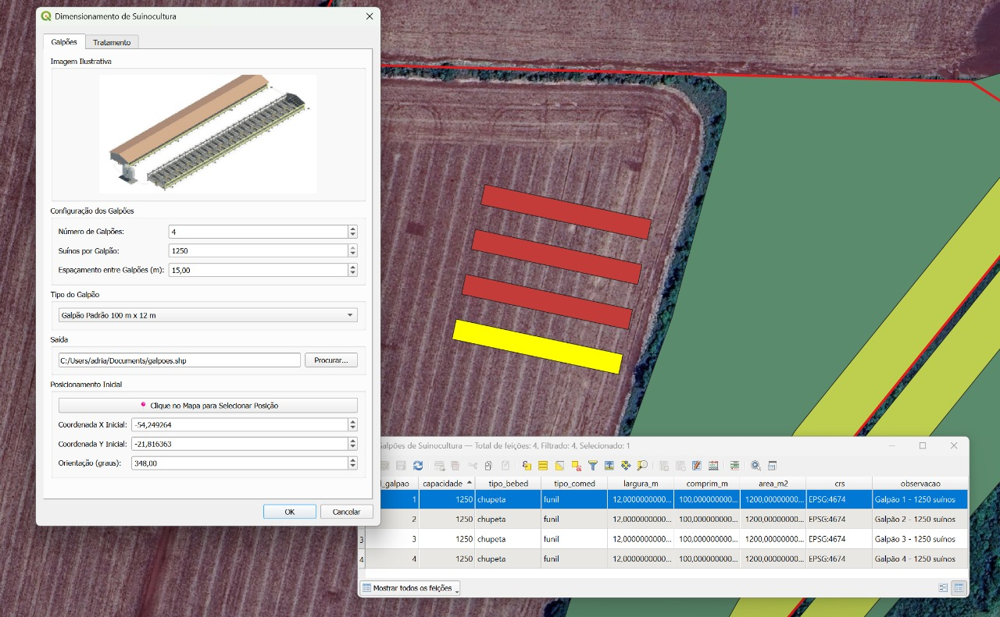
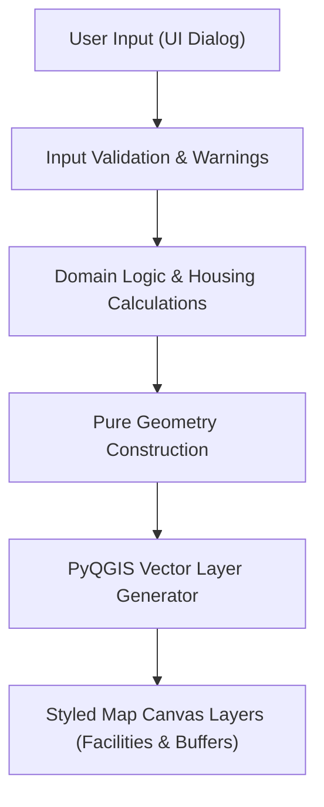
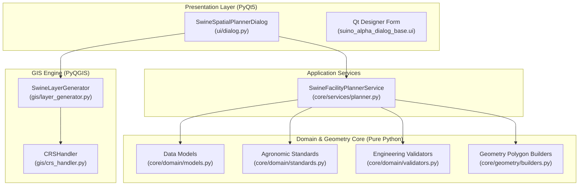

# SwineSpatialPlanner

A QGIS plugin for geospatial planning and analysis applied to livestock production systems.

## Overview

Modern swine production relies heavily on proper spatial layout and territorial siting. Inadequate positioning of housing facilities, manure treatment ponds, and feed silos can result in compromised animal welfare, insufficient natural cross-ventilation, sanitary vulnerabilities, and regulatory conflicts regarding environmental isolation distances from watercourses and property boundaries.

**SwineSpatialPlanner** is an experimental geospatial decision-support tool engineered as a QGIS plugin. It assists agricultural engineers, livestock planners, and GIS specialists in sizing, arranging, and evaluating swine facility footprints directly inside the geographic environment of the property.

By combining agronomic housing standards (animal density per phase, biosecurity isolation buffers, and airflow spacing) with geometric and PyQGIS spatial automation, the tool transforms abstract farm planning numbers into accurate vector layers on the project map canvas.

## Demo



*(Place your demonstration screenshot or animated GIF as `screen.jpg` in the repository root)*

## Features

- **Domain-Specific Facilities:** Support for typical swine infrastructure (Finishing, Nursery, Gestation, Farrowing, Wean-to-Finish, Quarantine, Feed Silos, Manure Lagoons, and Composting).
- **Geometric Sizing:** Parameterized generation of rectangular housing sheds (length × width) and circular structures (silos, circular waste lagoons, biodigestors).
- **Multi-Unit Series Distribution:** Automatic calculation of parallel shed placement with customizable spacing distances for natural cross-ventilation.
- **Biosecurity & Environmental Buffers:** Automated generation of recommended spatial buffer polygons (e.g., 50 m to 150 m sanitary perimeter).
- **Real-Time Technical Feedback:** In-dialog agronomic estimations of unit footprint area, total facility area, animal housing capacity, and biosecurity warnings.
- **Map Center Coordinate Capture:** One-click button to automatically grab coordinate center from current active QGIS map canvas.
- **Clean QGIS Integration:** Generates native in-memory vector layers (`memory:` polygon layers) styled with clear visual distinction between facilities and buffer zones.

## How It Works



1. **User Input:** The user specifies facility type, geometric dimensions, unit count, inter-shed spacing, and reference coordinates.
2. **Input Validation:** Domain validators verify physical viability and warn about non-standard rural engineering dimensions.
3. **Domain Calculations:** Housing capacity and biosecurity buffer distances are computed based on swine zootechnical references.
4. **Pure Geometry Construction:** Euclidean closed polygon rings are constructed for facility footprints and outer buffer envelopes.
5. **QGIS Layer Processing:** Polygon geometries and descriptive attributes (`id`, `tipo`, `area_m2`, `capacidade_animais`, `buffer_sanitario_m`) are packaged into QGIS vector layers and added to `QgsProject`.

## Architecture

The project follows clean separation of concerns, decoupling domain rules and geometry algorithms from UI and GIS framework bindings:



## GIS Capabilities

- **Coordinate System Awareness:** Integrates with the current `QgsProject` CRS (e.g., SIRGAS 2000 / UTM zone or local projected systems) to ensure metric calculations reflect true ground distances.
- **Euclidean Vector Generation:** Builds closed polygon rings for rectangular facilities and regular polygon approximations for circular structures.
- **Biosecurity Buffer Extrusions:** Generates outer polygon buffer envelopes representing sanitary safety perimeters and odor dispersion zones.
- **Memory Vector Provider:** Employs QGIS `memory:` layers for rapid iteration and prototyping without locking files to disk prematurely.
- **Attribute Table Population:** Encodes domain metadata directly into feature attributes for subsequent GIS analysis, symbology filtering, and reporting.

## Domain Logic

The domain rules represent established rural construction guidelines (such as Embrapa Swine & Poultry technical standards):

- **Housing Density Standards:**
  - Finishing (*Terminação*): ~1.00 m²/head.
  - Nursery (*Creche*): ~0.35 m²/head.
  - Gestation (*Gestação coletiva*): ~2.50 m²/sow.
  - Farrowing (*Maternidade*): ~4.50 m²/crate.
- **Ventilation & Airflow:** Checks for maximum recommended shed widths (typically 12 m – 16 m) to avoid poor natural cross-ventilation in non-climatized systems.
- **Sanitary Isolation & Buffers:** Assigns minimum safety distances (e.g., 50 m for production sheds, 150 m for manure lagoons).

## Technologies

- **Python 3**
- **QGIS 3.x**
- **PyQGIS**
- **PyQt5**
- **pytest** (pure Python unit test suite)

## Project Structure

```text
suino_alpha/
├── metadata.txt               # QGIS Plugin catalog metadata
├── suino_alpha.py             # Plugin entrypoint and QGIS lifecycle controller
├── suino_alpha_dialog.py      # Backward-compatible dialog wrapper
├── suino_alpha_dialog_base.ui # Qt Designer responsive interface definition
├── resources.qrc              # Qt resource definitions (compiled into resources.py)
├── core/
│   ├── domain/                # Pure Python domain logic & data models
│   │   ├── models.py          # Dataclasses (FacilitySpecification, PlannedFacility)
│   │   ├── standards.py       # Agronomic standards and zootechnical constants
│   │   └── validators.py      # Validation rules and engineering warnings
│   ├── geometry/              # Computational geometry algorithms
│   │   └── builders.py        # Polygon construction, rotation, and series spacing
│   └── services/              # Application services
│       └── planner.py         # SwineFacilityPlannerService orchestration
├── gis/                       # PyQGIS layer generation and projection management
│   ├── crs_handler.py         # CRS validation and coordinate transformations
│   └── layer_generator.py     # QgsVectorLayer construction and symbology
├── ui/                        # Presentation logic
│   └── dialog.py              # Interactive PyQt dialog controller
├── tests/
│   └── unit/                  # Standalone test suite (runs without opening QGIS)
│       ├── test_domain_models.py
│       ├── test_standards.py
│       ├── test_validators.py
│       ├── test_geometry_builders.py
│       └── test_planner_service.py
└── README.md                  # Project documentation
```

## Installation

1. Locate your QGIS 3 user profile plugins directory:
   - **Windows:** `%APPDATA%\QGIS\QGIS3\profiles\default\python\plugins\`
   - **Linux:** `~/.local/share/QGIS/QGIS3/profiles/default/python/plugins/`
   - **macOS:** `~/Library/Application Support/QGIS/QGIS3/profiles/default/python/plugins/`
2. Clone or copy this repository folder (`suino_alpha`) into the plugins folder.
3. Start or restart **QGIS 3**.
4. Open **Plugins → Manage and Install Plugins...**
5. Under the **Installed** tab, check the box next to **SwineSpatialPlanner** (or *SuinoAlpha*).

## Usage

1. Open a QGIS project set to an appropriate projected coordinate reference system (e.g., UTM / SIRGAS 2000).
2. Click the **Planejar Instalações Suinícolas** toolbar icon or select it from the **Plugins → SwineSpatialPlanner** menu.
3. In the dialog:
   - Select the **Tipo de Instalação** (e.g., *Terminação*).
   - Verify the geometric dimensions (length, width, or radius) and unit count.
   - Click **📍 Obter Coordenadas do Centro da Tela do QGIS** to center the facilities on your current view, or enter coordinates manually.
   - Review estimated footprint, animal housing capacity, and biosecurity buffer distances.
4. Click **OK**. Two new vector layers will be loaded into your project:
   - `Instalações - [Tipo]`: Colored footprint polygon of each unit.
   - `Buffers de Biosseguridade - [Tipo]`: Translucent boundary showing the sanitary buffer perimeter.

## Development & Environment

For development without QGIS installed in your primary Python path:
```bash
# Clone the repository
git clone https://github.com/adrianolopesgodoy/swine-spatial-planner.git
cd swine-spatial-planner

# Install testing dependencies
pip install pytest
```

## Tests

The project core and computational geometry can be tested directly from the command line without launching QGIS:

```bash
python -m pytest tests/unit -v
```

All 16+ unit tests run in less than 0.2 seconds and validate domain integrity, rotation mathematics, buffer envelope generation, and specification constraints.

## Limitations

- **Experimental Prototype:** This software is an engineering decision-support prototype. It does not replace on-site civil and environmental engineering projects.
- **Topography & Terrain:** Facility layouts currently assume locally planar terrain; slope analysis, cut-and-fill calculations, and digital elevation model (DEM) overlays are not yet integrated into the automated placement.
- **Simplified Buffer Envelopes:** Buffer polygons are computed geometrically based on radial/perimeter offsets; regional environmental regulations or prevailing wind vectors are not yet modeled dynamically.

## Roadmap

- [ ] Automated terrain slope analysis and cut/fill suitability ranking using raster DEMs.
- [ ] Wind rose integration to align facility orientation with local microclimate and odor dispersion patterns.
- [ ] Exportable technical planning reports (PDF / GeoPackage export).
- [ ] Support for customized user-defined zootechnical parameter profiles.
- [ ] Interactive on-map click placement tool using `QgsMapToolEmitPoint`.
